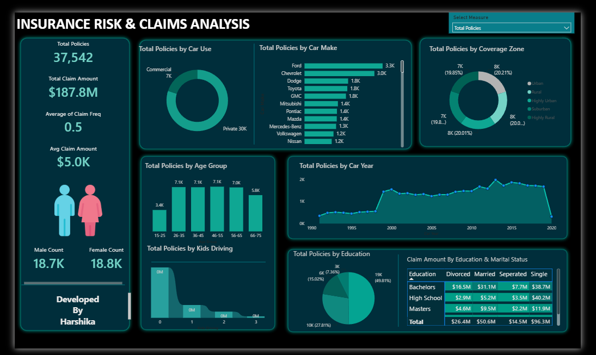
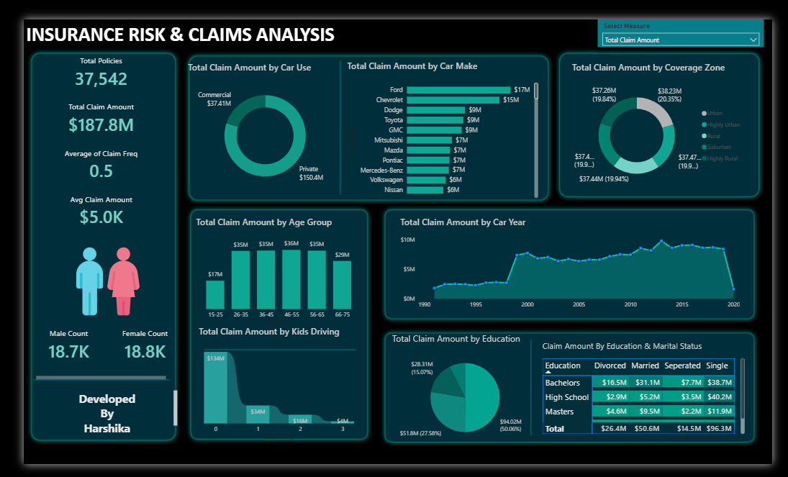

# 🚗 Insurance Claims Performance Dashboard

## 📌 Project Overview

This project is an interactive Power BI dashboard built to analyze insurance policies and claims data. It helps understand policy distribution, customer demographics, claim patterns, and business performance through interactive visualizations.

---

## 🎯 Business Problem

Insurance companies generate large amounts of policy and claims data. This dashboard provides a centralized view to monitor business performance, identify claim trends, and support data-driven decision-making.

---

## 🎯 Project Objectives

- Analyze insurance policy performance.
- Monitor claim amount and claim frequency.
- Compare customer demographics.
- Identify high-risk segments.
- Generate business insights through interactive dashboards.

---

## 🛠️ Tools & Technologies Used

- Microsoft Power BI
- Power Query
- DAX (Data Analysis Expressions)

---

## 📊 Key Performance Indicators (KPIs)

- Total Policies
- Total Claim Amount
- Average Claim Amount
- Average Claim Frequency
- Male Policy Count
- Female Policy Count

---

## 📈 Dashboard Features

- KPI Cards
- Donut Charts
- Bar Charts
- Area Chart
- Histogram
- Pie Chart
- Matrix Heat Map
- Interactive Slicers
- Dynamic Measure Selection

---

## 📊 Dashboard Visualizations

- Total Policies by Car Use
- Total Policies by Car Make
- Total Policies by Coverage Zone
- Total Policies by Age Group
- Total Policies by Car Year
- Total Policies by Kids Driving
- Total Policies by Education
- Claim Amount by Education & Marital Status

---

## 💡 Key Insights

- Commercial vehicles have a significant share of insurance policies.
- Claim amounts vary across different coverage zones.
- Customer demographics influence claim patterns.
- Education and marital status provide useful insights into customer behavior.
- The dashboard enables quick business performance analysis using interactive filters.

---

## 📂 Repository Contents

- Insurance Claims Performance Dashboard.pbix
- Insurance_Data.xlsx
- Dashboard_Screenshot_1.png
- Dashboard_Screenshot_2.png
- README.md

---

## 🚀 Skills Demonstrated

- Data Cleaning
- Data Transformation
- Data Modeling
- DAX Measures
- KPI Development
- Dashboard Design
- Data Visualization
- Business Intelligence
- Interactive Reporting
- Analytical Thinking

---

## 📷 Dashboard Preview

---

## 📌 Conclusion
This project demonstrates the use of Microsoft Power BI to build an interactive business intelligence dashboard for insurance policy and claims analysis. It helps identify trends, monitor KPIs, and support data-driven decision-making through effective visualizations.
